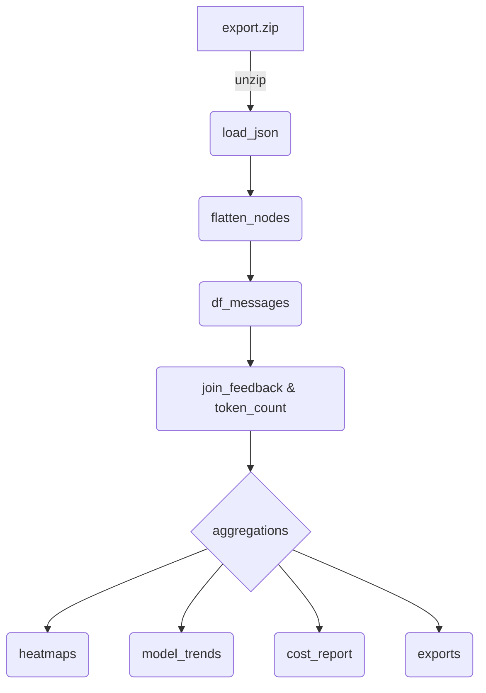

# ChatGPT User Data Export Analytics Project

> **Mission**  Build an easy to use yet insightful analysis script/notebook that transforms the raw data export from ChatGPT (and optionally Claude) into interesting and actionable insights built on clean DataFrames, rich visualizations, and concrete cost/usage calculations. This project should be easy to consume and easy to run. We build on industry standard python libraries such as pandas + matplotlib, and ship as an easy‑to‑run Jupyter notebook.

---

## 1  Project Snapshot

| Item                                                            | Summary                                                                                     |
| --------------------------------------------------------------- | ------------------------------------------------------------------------------------------- |
| **Primary input**                                               | `conversations.json` (ChatGPT export)  + optional Claude export                             |
| **Key outputs**                                                 | • GitHub‑style heatmaps (daily convo / message / token counts)                              |
|   • Model‑mix & trend plots                                     |                                                                                             |
|   • Cost vs subscription value analysis                         |                                                                                             |
|   • Per‑conversation & aggregate CSV / Markdown / JSONL exports |                                                                                             |
| **CLI / Notebook**                                              | `scripts/chatgpt_analysis.py` (stand‑alone) and `chatgpt_analytics.ipynb` (to be generated) |
| **Core deps**                                                   | Python ≥ 3.9, `pandas`, `matplotlib`, _optional_: `tiktoken` for exact token counts         |
| **Repo root**                                                   | `chatgpt-analytics/` — see §5 for layout                                                    |

---

## 2  Background & Existing Code

We already have **`chatgpt_analysis.py`** which:

1. Loads `conversations.json` (+ Claude if provided).
2. Converts conversation _start_ timestamps to local time.
3. Draws daily‑activity heatmaps (conversation‑level) and OpenAI vs Claude comparison.

**Next step:** Expand from _conversations/day_ to deeper metrics:

- **Message‑level counts** — a single conversation can span days; we’ll traverse the message graph to count user turns per calendar day.
- **Token usage** — compute total input & output tokens per message, daily aggregates, and by model.
- **Model analytics** — break down usage (conversations, messages, tokens, cost) per `metadata.model_slug`; plot trends.
- **Feature detection** — flag advanced/tool messages (e.g. deep‑research, browsing, DALL·E) by inspecting `content.content_type`, `metadata.finish_details`, or presence of `safe_urls`.
- **Cost model** — apply current OpenAI pricing to token counts, compare against ChatGPT Plus \$20/mo and hypothetical pay‑per‑use.

---

## 2  Background

OpenAI’s export delivers a ZIP containing structured JSON and an HTML digest. The richest file is `conversations.json`, which stores every conversation as a message‑tree with metadata (model, timestamps, feedback). Companion files (`user.json`, `message_feedback.json`, `model_comparisons.json`, `shared_conversations.json`, `chat.html`) add account context, thumbs‑up/down labels, alternative answers, share links, and a rendered view. Together they enable analytics, journaling, and dataset creation.

## 3  Key Data Files

| File                      | Role                                                      |
| ------------------------- | --------------------------------------------------------- |
| **conversations.json**    | Array of conversation objects with message trees (see §4) |
| user.json                 | User account metadata (id, email, plus‑subscription)      |
| message_feedback.json     | Thumb‑ratings & optional tags keyed by message_id         |
| model_comparisons.json    | Regenerate‑response attempts and chosen winners           |
| shared_conversations.json | Records of publicly shared chats                          |
| chat.html                 | One‑page human‑readable copy of all chats                 |

## 4  `conversations.json` Schema Highlights

```text
Conversation
├── title              (str)
├── create_time        (float – unix seconds)
├── update_time        (float)
├── current_node       (str  – id of active leaf)
├── mapping            (dict[id → Node])
└── …
Node
├── id                 (str)
├── parent             (str|null)
├── children           (list[str])
└── message            (dict|null)
        ├── author.role        {system|user|assistant}
        ├── create_time        (float)
        ├── content.parts      (list[str])
        ├── metadata.model_slug, finish_details, …
        └── end_turn / weight / recipient
```

- The first node (`parent:null`) is a **root placeholder**.
- Branching occurs when a user regenerates or edits; a parent may have ≥2 children.
- `metadata.model_slug` identifies the model (e.g. `gpt-4`, `gpt-3.5-turbo`).
- `safe_urls` (top‑level) lists any images/links whitelisted in that conversation.
- conversations.json contains an array of conversation object. Example conversation objects are available for inspect in the the /samples directory.
- An example of the chatgpt export folder content is contained in /chatgpt_export. When developing a new features, please ensure that the script run successfully against this directory. Built unit tests on the entire dataset or a subset of it to verify your core logic and assumptions.

## 5  Key Data Concepts

### 5.1  Message Graph Schema (recap)

```text
Conversation  →  mapping[id → Node]
Node          →  { id, parent, children[], message }
message       →  { author.role, content.parts[], create_time, metadata.{model_slug, …} }
```

_Root node_ ➜ System ➜ User / Assistant alternating; branching from regenerations/edits.

### 5.2  Token Counting Strategy

1. Join `content.parts` into a single string per message.
2. **If `tiktoken` available** → use correct encoding by model slug (e.g. `cl100k_base` for GPT‑4/GPT‑3.5).
3. **Fallback** → rough heuristic: 1 token ≈ 4 chars (English), or count whitespace‑separated words × 1.33. Document the error margin.
4. Store as `input_tokens` for user messages, `output_tokens` for assistant messages.

---

## 6  Pipeline Overview

This is just a suggestion. Update this section if you come up with better approaches!



### 6.1  Target DataFrames

| DataFrame       | Primary columns                                                                     |
| --------------- | ----------------------------------------------------------------------------------- |
| **df_messages** | `msg_id`, `conv_id`, `author`, `text`, `create_ts`, `model`, `tokens`, `branch_idx` |
| **df_days**     | aggregation of conversations/messages/tokens by `date` & `model`                    |
| **df_cost**     | `date`, `model`, `prompt_tokens`, `comp_tokens`, `cost_usd`                         |

---

## 7  Repository Layout

```text
chatgpt-analytics/
├── samples/                 # small message objects for unit tests
├── scripts/
│   ├── chatgpt_analysis.py        # current conversation‑count heatmap script
│   └── future modules …
├── notebooks/
│   └── chatgpt_analytics.ipynb  # to be generated & kept in sync with scripts
├── AGENT.md                 # <–– you’re here
└── LICENSE
```

> **Convention**  Scripts live under `scripts/`, notebooks under `notebooks/`, sample JSON under `samples/`.

---

## 8 Contributing

When an AI Agent implements major code changes, and/or complete items on the roadmap, be sure to document it in this Agent.md, as this is the main context an AI coding Agent will receive the next time it's invoked to work on a feature.

It is crucial that the AI Agent writes correct and efficient code. For every core logic function, maintain unit tests under /tests to verify the logic. Use actual data from /chatgpt_export or /samples to verify your assumptions.

Also try to write an end-to-end test to ensure the chatgpt_analysis.py script works as intended.

## 9 Roadmap

Update this setion whenever a roadmap item has been completed.

1. The script counts the number of convos. I want to also analyze the number of user messages sent each day since a single conversation can span multiple days.

2. Counting the number of tokens used by the users - specifically, traversing the nodes in the messages graph to get a precise count of how many input/output tokens the user would consume if they were using the API.

3. Model analysis - break down of user's convo/message/token count by model. What is the user's favorite model? What is the trend over time?

4. Does user use advanced features such as deep research? if so, how often?

5. Cost analysis - Based on token count and model analysis - is the user getting their money's worth with their chatgpt subscription? Could they have saved money by pay-per-use instead? Do a precise calculation using token count and model pricing data.

## 10  License & Attribution

MIT; credit any borrowed code (e.g., original chatgpt_analysis notebook by Chip Huygen).

## Apendix A: Deep Research Report on Structure of converstions.json in ChatGPT Exports

> Please note the following research is based on Internet sources, which may be out of date. Use it for high-level understanding and inspiration. Whenever actual data differs from what's described in this report, the actual data is the gold standard. Be sure to verify your work on the actual data and not just a description of it from this report.

When you export your ChatGPT data, you receive a ZIP containing multiple files (JSON and HTML). The cornerstone is **`conversations.json`**, which holds your entire chat history in structured form. Each conversation is a JSON object with fields capturing metadata and the message **tree** for that chat. Below we break down the schema of `conversations.json`, how conversation threads are organized (including messages, authors, parent/child relationships, etc.), and then outline other export files (`user.json`, `message_feedback.json`, `model_comparisons.json`, `shared_conversations.json`, `chat.html`). Finally, we explore community tools and examples that use this data for visualization, exporting, analysis, and dataset creation.

## Top-Level Schema of `conversations.json`

Each entry in the `conversations.json` array represents one conversation. The top-level fields for a conversation include (field names in quotes, types in parentheses):

- **`title`** (Text): The user-defined or auto-generated title of the conversation (as seen in the ChatGPT sidebar).
- **`create_time`** (Number): Timestamp when the conversation was started, in Unix seconds (often with fractional part).
- **`update_time`** (Number): Timestamp of the last update (e.g. last message) in the conversation. This might be the same as the last message’s create time.
- **`mapping`** (Dictionary/Object): The **message tree** of the conversation. This is the most complex field (detailed in the next section).
- **`moderation_results`** (Array): An array of moderation outcomes for the conversation. Usually empty (`[]`) if no message was flagged or moderated. (If ChatGPT’s content filter was triggered, relevant info might appear here.)
- **`current_node`** (Text): The ID of the current last message node in the conversation (i.e. the node representing the latest assistant or user turn on the active branch). This helps identify which branch of the conversation is “active” (especially if there are alternate paths from regenerated answers).
- **`plugin_ids`** (Array or Null): IDs of any plugins/tools used in the conversation. This is `null` if no plugins were invoked (common for most conversations).
- **`conversation_id`** (Text) and **`id`** (Text): Identifiers for the conversation. In current exports, the `id` field is the conversation’s unique UUID. Some exports also include a separate `conversation_id` field (often identical to `id` or an alternate ID).
- **`conversation_template_id`** (Null or Text): Usually `null`. Possibly reserved for specific system templates or shared conversation templates.
- **`gizmo_id`** and **`gizmo_type`** (Null or Text): Typically `null`. Internal fields possibly related to special message types or UI gizmos (e.g. search or image canvas) in certain experimental features.
- **`is_archived`** (Boolean): Whether the conversation has been archived by the user. Archived conversations are hidden in the UI but preserved in the export (this will be `false` unless you used the _Archive_ feature).
- **`is_starred`** (Boolean or Null): A field for favorites. In current exports this may be `null` or `false` (the ChatGPT UI does not yet expose “starring” chats, but the field exists for future use).
- **`safe_urls`** (Array): A list of whitelisted URLs referenced in the conversation. This is used by ChatGPT to allow certain links in the content. If the assistant’s answer contains hyperlinks or images, those URLs may appear here (ensuring they are not stripped out by the client as unsafe).

**Example:** A top-level conversation entry might look like (with IDs shortened for readability):

```json
{
  "title": "A320 Hydraulic System Failure.",
  "create_time": 1682368832.626937,
  "update_time": 1682369104.0,
  "mapping": { … },                 ← see below
  "moderation_results": [],
  "current_node": "msg-id-4",       ← last message node ID
  "plugin_ids": null,
  "id": "conv-id-1234"
}
```

_(In this example from an export, no plugins or moderation flags were involved, and the conversation had an auto-generated title.)_

## The `mapping` Field: Conversation as a Message Tree

The `mapping` object contains all messages in the conversation, structured as a **tree**. Each key in `mapping` is a message node ID (a UUID string) pointing to an object with the following fields:

- **`id`** (Text): The same UUID identifier of this message node.
- **`message`** (Dictionary or null): The content of the message _if_ this node represents an actual message. If `message` is null, it means this node is a placeholder (usually the root of the tree).
- **`parent`** (Text or null): The ID of the parent node in the conversation tree. The very first node (root) has `"parent": null`. Other nodes have a parent ID linking to the previous turn.
- **`children`** (Array of Text): A list of IDs of this node’s child nodes (i.e. the next turns). Most user or assistant messages have either 0 or 1 child normally – but multiple children indicate **branches** (e.g. a user message with two different assistant replies will have two children, representing alternate responses).

**Conversation flow:** The tree’s root node is a system placeholder. In each conversation, you will typically find:

- **Root node:** A node with `parent: null` and usually `message: null`. Its `children` contains the ID of the first actual message node. This root exists to anchor the conversation thread.
- **System message node:** Often the first child of the root is a system message (role “system”) which may contain an empty content or system instructions. In many exports this system message has an empty string content (ChatGPT often inserts a blank system message as context). The system message node’s parent is the root; its child will be the first user message.
- **User and Assistant message nodes:** These form the alternating sequence of the conversation. Each user message node’s `children` will include the assistant’s response node, and each assistant node’s `children` include the next user turn, and so on.

**Example structure:** Suppose a simple conversation: _User:_ “Write a poem about the Turing test.” -> _Assistant:_ (writes a poem). The mapping might look like:

```json
"mapping": {
   "root-id": {
      "id": "root-id",
      "message": null,
      "parent": null,
      "children": ["sys-id"]       ← root’s child is system message
   },
   "sys-id": {
      "id": "sys-id",
      "message": { ... "role": "system", "content": { "parts": [""] }, ... },
      "parent": "root-id",
      "children": ["user-id"]      ← system’s child is user message
   },
   "user-id": {
      "id": "user-id",
      "message": { ... "role": "user", "content": { "parts": ["write a poem about the Turing test"] }, ... },
      "parent": "sys-id",
      "children": ["assist-id"]    ← user’s child is assistant answer
   },
   "assist-id": {
      "id": "assist-id",
      "message": { ... "role": "assistant", "content": { "parts": ["<poem lines>"] }, ... },
      "parent": "user-id",
      "children": []               ← assistant’s answer is last node
   }
}
```

Here, `"root-id"` has no message (just a structural node) and is parent to `"sys-id"` (the system context message). The user message `"user-id"` is a child of that system message, and the assistant’s reply `"assist-id"` is a child of the user prompt. The assistant node has an empty children list, marking the end of this thread. The `current_node` for this convo would be `"assist-id"`, the last message.

### Branching and Alternate Paths

The tree structure allows for **branches** in the conversation, which occur in a few scenarios:

- **Regenerated responses:** If you click “Regenerate response” for an assistant message, the original assistant answer remains in the data as a child of the user prompt, and a new assistant message is added _as an additional child of the same user node_. In the mapping, a user node can have multiple assistant children (siblings to each other). Only one is “active” (the one you ultimately kept). The export notes which one is current via `current_node` and by the absence of further children on inactive paths. Tools like the ChatGPT Tree visualizer confirm that parent messages can have multiple children when multiple answers were given and one was chosen. For example, an assistant message with two attempts would produce something like: `"user-id": {children: ["assist-v1-id", "assist-v2-id"]}` where each assist node has `message.author.role = "assistant"` and content variants. The UI’s active path is typically the last child (and likely the `current_node` follows that branch).
- **User edits:** If you edited an earlier user message, ChatGPT may replace subsequent content with a new branch. The original replies might remain as a separate branch in the JSON (or be moved to `model_comparisons.json`, discussed later). Edits can thus also lead to parent nodes with multiple children.
- **Multi-answer features:** In rare cases, ChatGPT might provide multiple answers (e.g. when using certain plugins or the experimental “drafts” feature that shows multiple solutions). These would appear as multiple assistant children under one parent prompt.

In the JSON, all branches are preserved. The **active conversation** (the one shown in _chat.html_ or the ChatGPT UI) follows one path down the tree from root to a leaf. The other branches (e.g., an unused regenerated answer) will still be present in `mapping` but won’t be reachable by following single-child links from the root. You can detect branches by any node with more than one ID in its `children` array.

**Tip:** To linearize a conversation, start at the root node (find the node with `parent: null`), then repeatedly follow the first (or desired) child ID until you reach a node with no children. This will follow the main path. The dev community often does this recursively to export chats as text or Markdown.

### Message Objects: `author`, `content`, and Metadata

Each actual message node in `mapping` has a **`message`** object with detailed info:

- **`id`** (Text): The same ID again (for convenience, the message object repeats its node’s ID).

- **`author`** (Dictionary): Describes who sent the message. It has:

  - **`role`** (Text): One of `"user"`, `"assistant"`, or `"system"`.
  - **`name`** (Null or Text): Usually null. (Potentially used if a system or tool message has a name, or for future multi-user chats).
  - **`metadata`** (Dictionary): Additional info about the author or message source. Often empty for user/assistant. System messages might include flags here. (In most exports, this is just an empty object `{}`).

- **`create_time`** (Number): Timestamp when this message was created. This is typically in Unix seconds (float). It can be used to order messages or analyze timing between messages.

- **`update_time`** (Number or null): Timestamp if the message was last updated/edited. Usually `null` for most messages (unless an edit occurred).

- **`content`** (Dictionary): The actual content of the message. It includes:

  - **`content_type`** (Text): The format or type of content. For normal text exchanges this is `"text"`. In newer chats it can be other types (see below).
  - **`parts`** (Array): The message content broken into parts. For text content, this is typically an array with a single string element – the full text of the message. The use of an array allows for streaming or multi-part messages, but in exports it’s usually one part per message.

  _Example:_ For a user question, `content` might be:

  ```json
  "content": {
      "content_type": "text",
      "parts": ["What happens when one hydraulic system fails?"]
  }
  ```

  and for an assistant answer, `parts` would contain the answer text (potentially including `\n` newlines, Markdown, etc.).

- **`end_turn`** (Boolean or null): Indicates if the message marked end of a turn. Often `true` for final assistant messages in a turn. In many exports, user messages have `end_turn: null` and assistant replies have `end_turn: true` (or sometimes `false` if the assistant’s message was meant to be continued).

- **`weight`** (Number): A field often set to `1` for all messages. (This might relate to system internals for ordering or prioritization, but in practice it’s not significant for analysis – you’ll usually see `1.0` for each message.)

- **`metadata`** (Dictionary): A **rich metadata** object with various subfields. This is where ChatGPT records additional info about the message, like what model produced it, any special annotations, etc. Some common subfields:

  - **`message_type`**: Often `null` for standard messages. (If the message was a special type, it might be indicated here. E.g. a “system” type message or tool invocation might have a type.)
  - **`model_slug`**: Identifier of the model used for an assistant’s response. For example, `"text-davinci-002-render-sha"` (an older ChatGPT model codename for GPT-3.5) or `"gpt-4"` for GPT-4 responses. This appears only for **assistant** messages, indicating which model produced the reply.
  - **`finish_details`**: Info about how the message generation finished. Usually a sub-object like `{"type": "stop", "stop": "<|im_end|>"}` meaning the assistant stopped naturally. If a message was cut off or had an error, this might differ (e.g. `"length"` if it stopped due to length limit).
  - **`timestamp_`**: Sometimes `"absolute"` (indicating the `create_time` is an absolute timestamp). This might be used by the UI to display time.
  - **`is_complete`**: For assistant messages, a boolean indicating if the model finished its answer (e.g. `true` if completed).
  - **`status`**: A string like `"finished_successfully"` for a completed response or other statuses for incomplete ones.
  - **`parent_id`**: In some exports, the assistant message metadata redundantly stores the parent message’s ID here as well (this duplicates the `parent` field at the node level).
  - **`inline_gizmo_id`**: If the assistant used an internal tool (e.g. a search or calculator “gizmo”), an ID might appear here (often `null`).
  - **`citations`**: In conversations where the assistant used web browsing or provided citations, this could list citation objects or references (e.g. URLs). Usually empty unless the answer has references.
  - **`voice_mode_message`**: A boolean (e.g. `false`) – possibly indicating if this was a voice transcription (for future voice input features).
  - **Custom instructions**: If you had _Custom Instructions_ enabled (a feature where you provided “about you” and “how you want ChatGPT to respond”), these often appear as special system messages or metadata in each new conversation. In newer exports, the `metadata` for the initial system message node may include fields like `is_user_system_message: true` and a `user_context_message_data` object containing your custom instructions. For example, `user_context_message_data` can have `about_user_message` and `about_model_message` text that reflect your saved instructions. These are inserted by the system at conversation start. (If you see a system message with your custom bio/preferences, that’s what this is.)

- **`recipient`** (Text): Usually `"all"`, indicating who the message was intended for. (In a one-on-one chat, “all” makes sense as both user and assistant see it. If in multi-party or tool contexts, this might specify target audience.)

Summarizing, a **user message** will have `author.role = "user"`, no `model_slug` in metadata, and typically minimal metadata (maybe a timestamp and message_type null). An **assistant message** will have `role = "assistant"`, and metadata including the model and finish reason, etc. A **system message** (the initial one) often has empty content and empty metadata except possibly the custom instruction fields.

**Example message objects:**

- _System message node:_

  ```json
  "message": {
    "id": "sys-id",
    "author": { "role": "system", "name": null, "metadata": {} },
    "create_time": 1682369079.639335,
    "update_time": null,
    "content": { "content_type": "text", "parts": [""] },
    "end_turn": true,
    "weight": 1.0,
    "metadata": {},
    "recipient": "all"
  }
  ```

  _(A blank system starter with end_turn true – meaning it doesn’t expect a reply, allowing user to speak next.)_

- _User message node:_

  ```json
  "message": {
    "id": "user-id",
    "author": { "role": "user", "name": null, "metadata": {} },
    "create_time": 1682368832.628375,
    "update_time": null,
    "content": {
      "content_type": "text",
      "parts": ["What happens when one hydraulic system fails?"]
    },
    "end_turn": null,
    "weight": 1.0,
    "metadata": { "timestamp_": "absolute", "message_type": null },
    "recipient": "all"
  }
  ```

  _(A user question – note `end_turn` is null (since user’s turn naturally ends when they finish asking), and `message_type` is null.)_

- _Assistant message node:_

  ```json
  "message": {
    "id": "assist-id",
    "author": { "role": "assistant", "name": null, "metadata": {} },
    "create_time": 1682368856.590211,
    "update_time": null,
    "content": {
      "content_type": "text",
      "parts": ["The Airbus A320 is equipped with three independent hydraulic systems... (explanation)"]
    },
    "end_turn": true,
    "weight": 1.0,
    "metadata": {
      "message_type": null,
      "model_slug": "text-davinci-002-render-sha",
      "finish_details": { "type": "stop", "stop": "<|im_end|>" },
      "timestamp_": "absolute"
    },
    "recipient": "all"
  }
  ```

  _(An assistant answer – note the model slug indicating which model (a ChatGPT variant of GPT-3.5) generated it, and `finish_details` showing it stopped normally at the end token. `end_turn: true` signals the assistant finished and it’s user’s turn next.)_

**Non-text content:** With newer ChatGPT features, `content_type` can vary:

- For example, when ChatGPT includes **images** (DALL·E 3 integration or vision output), the assistant’s `content_type` might be `"multimodal_text"`. The `parts` then hold a list of objects rather than plain strings. E.g. `parts: [ { "content_type": "image_asset_pointer", "asset_pointer": "file-service://file_id_xyz", ... } ]` along with possibly some text parts. The `asset_pointer` is a reference to the generated image file. In such cases, `safe_urls` at the convo top may contain actual URL(s) for these images (so you as the data owner can retrieve them). If a user **sent an image** to ChatGPT (vision input), you might see `content_type: "real_time_user_audio_video_asset_pointer"` with pointers to the image data in the user message.
- If the assistant used a **code interpreter** or other tool, you might see messages with `content_type: "execution_output"` or similar, and possibly file attachments in metadata.
- These advanced content types are beyond basic Q\&A, but the export does capture them with similar patterns: an outer `content_type` distinguishing the payload, and internal structures in `parts` or `metadata` for the actual data.

## Other Exported Files and Their Contents

In addition to `conversations.json`, the data export ZIP includes several other files. These provide context about the user and interactions, which can **complement** the conversation data for analysis or application development:

- **`user.json`:** Contains your basic account info. The format is:

  ```json
  {
    "id": "<USER ID>",
    "email": "<USER EMAIL>",
    "chatgpt_plus_user": <true|false>,
    "phone_number": "<PHONE or null>"
  }
  ```

  This shows a unique user ID (likely a UUID), your email address, whether you’re a ChatGPT Plus subscriber, and your phone number on file. While it doesn’t directly link to conversations, it’s useful for identifying the dataset’s owner in analysis or if building a multi-user app (e.g., if combining data from multiple exports).

- **`message_feedback.json`:** This file logs any feedback you gave on ChatGPT’s messages (the 👍 “thumbs-up” or 👎 “thumbs-down” ratings, along with optional tags/reasons). It is an array of feedback entries. Each entry typically has:

  - `message_id`: the ID of the message you rated,
  - `conversation_id`: the conversation containing that message,
  - `user_id`: your user ID,
  - `rating`: either `"thumbsUp"` or `"thumbsDown"`,
  - `content`: a JSON string with additional feedback detail (often a `tags` array). By default, a thumbs-down might be tagged as `"not-helpful"`, and a thumbs-up as `"helpful"`, etc.

  **Example:**

  ```json
  [
    {
      "message_id": "assist-id-xyz",
      "conversation_id": "conv-id-1234",
      "user_id": "user-id-789",
      "rating": "thumbsDown",
      "content": "{\"tags\": [\"not-helpful\"]}"
    }
  ]
  ```

  Each such entry tells you which specific answer you reacted to. This complements `conversations.json` by letting you identify which assistant outputs you liked or disliked. For instance, for analytics you could join this with the conversation data to see if certain models or lengths of answers get more thumbs-down, etc. The presence of a feedback entry means the corresponding `message_id` in `conversations.json` was rated by you. (No entry means no explicit feedback was given for that message.)

- **`model_comparisons.json`:** This file logs instances where you used the _“Regenerate response”_ feature, capturing the model’s multiple attempts. Essentially, whenever you get a second (or third) answer for the same prompt and maybe choose one as better, ChatGPT records a comparison. The data is stored as entries with fields like:

  - `id`: a unique ID for the comparison event,
  - `user_id`: your user ID,
  - `input`: an object representing the prompt or conversation context used,
  - `output`: an object (or possibly array) representing the responses compared,
  - possibly a `model_ids` or metadata about which models/versions were involved.

  The **content** of `input` and `output` here is text-based (not full conversation threads, but snippets). It _“contains snippets of the conversations and the consecutive attempts anytime ChatGPT regenerated the response”_. In other words, it logs the question and the various answers given. This file does **not** include the conversation `title` or message tree, just the raw Q\&A text and some metadata. It’s meant for internal use (helping improve the model via comparisons) but you can use it to see how often you asked for re-generation and what the alternative answers were. For example, if you had a tricky question and tried 3 responses, you might find one entry here with your question and all 3 answers. This complements `conversations.json` because the main conversation likely only shows the final chosen answer on the active branch, whereas `model_comparisons.json` preserves _other_ attempts that you didn’t keep. It’s useful if you want to analyze which answer you preferred or to build a dataset of alternative completions.

- **`shared_conversations.json`:** This appears if you have used the _Share Link_ feature for chats. (ChatGPT introduced the ability to share a conversation via a public URL.) The `shared_conversations.json` file contains conversations that were shared with others or by others. In the export, it typically includes any conversation you’ve made public. It might list fields like the `shared_url` or share ID token, the conversation ID, and possibly a flag if you were the sharer or a viewer. If you never shared any chats, this file may be empty or not present. If present, it’s useful for mapping which of your convos have public URLs or for retrieving those URLs. In one example export, the ZIP listed `shared_conversations.json` alongside the other files. (This feature was added later, so older exports might not include it.)

- **`chat.html`:** An HTML file containing your **entire chat history** in a human-readable format. When you open `chat.html` in a browser, you’ll see all your conversations listed (usually in chronological or reverse chronological order) with their titles. Each conversation in the HTML is formatted in a chat style: the user prompts and assistant responses are labeled or styled differently (often prefixed with “User:” and “Assistant:” or through CSS). Essentially, it’s a single-page dump of all chats. It’s convenient for quick reading or searching (you can use your browser’s find feature to search all chats at once). However, it’s not structured for programmatic parsing like the JSON is. The `chat.html` is useful as a reference to see the formatting as you saw it on the site (including Markdown rendering like code blocks, etc., and any images as inline `` tags). If you’re building an app or analysis, you’d likely use `conversations.json` instead, but `chat.html` can help for sanity-checking that your JSON parsing is correct (since it shows the same content). For example, if you want to search your chat history by keyword without writing a JSON parser, opening `chat.html` and hitting Ctrl-F is a quick solution.
