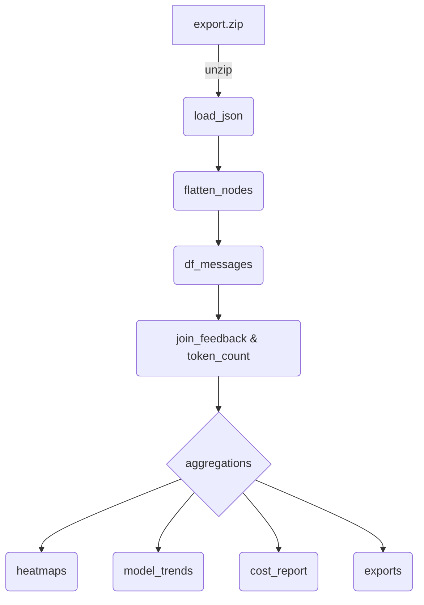

# ChatGPT User Data Export Analytics Project

> **Mission**  Build an easy to use yet insightful analysis script/notebook that transforms the raw data export from ChatGPT (and optionally Claude) into interesting and actionable insights built on clean DataFrames, rich visualizations, and concrete cost/usage calculations. This project should be easy to consume and easy to run. We build on industry standard python libraries such as pandas + matplotlib, and ship as an easy‑to‑run Jupyter notebook.

---

## 1  Project Snapshot

| Item                                                            | Summary                                                                               |
| --------------------------------------------------------------- | ------------------------------------------------------------------------------------- |
| **Primary input**                                               | `conversations.json` (ChatGPT export)  + optional Claude export                       |
| **Key outputs**                                                 | • GitHub‑style heatmaps (daily convo / message / token counts)                        |
|   • Model‑mix & trend plots                                     |                                                                                       |
|   • Cost vs subscription value analysis                         |                                                                                       |
|   • Per‑conversation & aggregate CSV / Markdown / JSONL exports |                                                                                       |
| **CLI / Notebook**                                              | `scripts/ai_heatmap.py` (stand‑alone) and `chatgpt_analytics.ipynb` (to be generated) |
| **Core deps**                                                   | Python ≥ 3.9, `pandas`, `matplotlib`, _optional_: `tiktoken` for exact token counts   |
| **Repo root**                                                   | `chatgpt-analytics/` — see §5 for layout                                              |

---

## 2  Background & Existing Code

We already have **`ai_heatmap.py`** which:

1. Loads `conversations.json` (+ Claude if provided).
2. Converts conversation _start_ timestamps to local time.
3. Draws daily‑activity heatmaps (conversation‑level) and OpenAI vs Claude comparison.

**Next step:** Expand from _conversations/day_ to deeper metrics:

- **Message‑level counts** — a single conversation can span days; we’ll traverse the message graph to count user turns per calendar day.
- **Token usage** — compute total input & output tokens per message, daily aggregates, and by model.
- **Model analytics** — break down usage (conversations, messages, tokens, cost) per `metadata.model_slug`; plot trends.
- **Feature detection** — flag advanced/tool messages (e.g. deep‑research, browsing, DALL·E) by inspecting `content.content_type`, `metadata.finish_details`, or presence of `safe_urls`.
- **Cost model** — apply current OpenAI pricing to token counts, compare against ChatGPT Plus \$20/mo and hypothetical pay‑per‑use.

---

## 2  Background

OpenAI’s export delivers a ZIP containing structured JSON and an HTML digest. The richest file is `conversations.json`, which stores every conversation as a message‑tree with metadata (model, timestamps, feedback). Companion files (`user.json`, `message_feedback.json`, `model_comparisons.json`, `shared_conversations.json`, `chat.html`) add account context, thumbs‑up/down labels, alternative answers, share links, and a rendered view. Together they enable analytics, journaling, and dataset creation.

## 3  Key Data Files

| File                      | Role                                                      |
| ------------------------- | --------------------------------------------------------- |
| **conversations.json**    | Array of conversation objects with message trees (see §4) |
| user.json                 | User account metadata (id, email, plus‑subscription)      |
| message_feedback.json     | Thumb‑ratings & optional tags keyed by message_id         |
| model_comparisons.json    | Regenerate‑response attempts and chosen winners           |
| shared_conversations.json | Records of publicly shared chats                          |
| chat.html                 | One‑page human‑readable copy of all chats                 |

## 4  `conversations.json` Schema Highlights

```text
Conversation
├── title              (str)
├── create_time        (float – unix seconds)
├── update_time        (float)
├── current_node       (str  – id of active leaf)
├── mapping            (dict[id → Node])
└── …
Node
├── id                 (str)
├── parent             (str|null)
├── children           (list[str])
└── message            (dict|null)
        ├── author.role        {system|user|assistant}
        ├── create_time        (float)
        ├── content.parts      (list[str])
        ├── metadata.model_slug, finish_details, …
        └── end_turn / weight / recipient
```

- The first node (`parent:null`) is a **root placeholder**.
- Branching occurs when a user regenerates or edits; a parent may have ≥2 children.
- `metadata.model_slug` identifies the model (e.g. `gpt-4`, `gpt-3.5-turbo`).
- `safe_urls` (top‑level) lists any images/links whitelisted in that conversation.
- conversations.json contains an array of conversation object. Example conversation objects are available for inspect in the the /samples directory.

## 5  Key Data Concepts

### 5.1  Message Graph Schema (recap)

```text
Conversation  →  mapping[id → Node]
Node          →  { id, parent, children[], message }
message       →  { author.role, content.parts[], create_time, metadata.{model_slug, …} }
```

_Root node_ ➜ System ➜ User / Assistant alternating; branching from regenerations/edits.

### 5.2  Token Counting Strategy

1. Join `content.parts` into a single string per message.
2. **If `tiktoken` available** → use correct encoding by model slug (e.g. `cl100k_base` for GPT‑4/GPT‑3.5).
3. **Fallback** → rough heuristic: 1 token ≈ 4 chars (English), or count whitespace‑separated words × 1.33. Document the error margin.
4. Store as `input_tokens` for user messages, `output_tokens` for assistant messages.

---

## 6  Pipeline Overview

This is just a suggestion. Update this section if you come up with better approaches!



### 6.1  Target DataFrames

| DataFrame       | Primary columns                                                                     |
| --------------- | ----------------------------------------------------------------------------------- |
| **df_messages** | `msg_id`, `conv_id`, `author`, `text`, `create_ts`, `model`, `tokens`, `branch_idx` |
| **df_days**     | aggregation of conversations/messages/tokens by `date` & `model`                    |
| **df_cost**     | `date`, `model`, `prompt_tokens`, `comp_tokens`, `cost_usd`                         |

---

## 7  Repository Layout

```text
chatgpt-analytics/
├── samples/                 # small message objects for unit tests
├── scripts/
│   ├── ai_heatmap.py        # current conversation‑count heatmap script
│   └── future modules …
├── notebooks/
│   └── chatgpt_analytics.ipynb  # to be generated & kept in sync with scripts
├── AGENT.md                 # <–– you’re here
└── LICENSE
```

> **Convention**  Scripts live under `scripts/`, notebooks under `notebooks/`, sample JSON under `samples/`.

---

## 8 Contributing

When an AI Agent implements major code changes, and/or complete items on the roadmap, be sure to document it in this Agent.md, as this is the main context an AI coding Agent will receive the next time it's invoked to work on a feature.

## 9 Roadmap

Update this setion whenever a roadmap item has been completed.

1. The script counts the number of convos. I want to also analyze the number of user messages sent each day since a single conversation can span multiple days.

2. Counting the number of tokens used by the users - specifically, traversing the nodes in the messages graph to get a precise count of how many input/output tokens the user would consume if they were using the API.

3. Model analysis - break down of user's convo/message/token count by model. What is the user's favorite model? What is the trend over time?

4. Does user use advanced features such as deep research? if so, how often?

5. Cost analysis - Based on token count and model analysis - is the user getting their money's worth with their chatgpt subscription? Could they have saved money by pay-per-use instead? Do a precise calculation using token count and model pricing data.

## 10  License & Attribution

MIT; credit any borrowed code (e.g., original ai_heatmap notebook by Chip Huygen).
